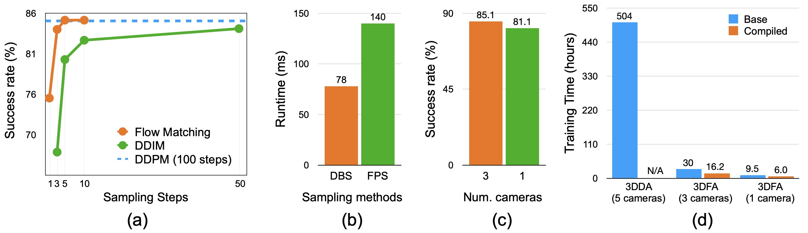
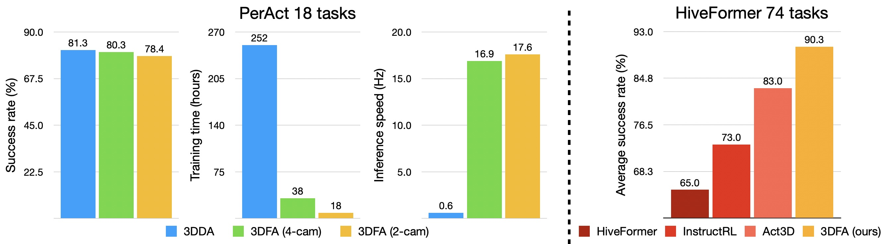

# 3D FlowMatch Actor: Unified 3D Policy for Single- and Dual-Arm Manipulation
By [Nikolaos Gkanatsios*](https://nickgkan.github.io/), [Jiahe Xu*](https://github.com/JiaheXu), [Matthew Bronars](https://mbronars.github.io/), [Arsalan Mousavian](https://cs.gmu.edu/~amousavi/), [Tsung-Wei Ke](https://twke18.github.io/) and [Katerina Fragkiadaki](https://www.cs.cmu.edu/~katef/)


Official implementation of ["3D FlowMatch Actor: Unified 3D Policy for Single- and Dual-Arm Manipulation"](arxiv_link).

This code base also includes a faster re-implementation of [3D Diffuser Actor](https://arxiv.org/abs/2402.10885).


We present 3D FlowMatch Actor (3DFA), a 3D policy architecture for robot manipulation that combines flow matching for trajectory prediction with 3D pretrained visual scene representations for learning from demonstration. 3DFA leverages 3D relative attention between action and visual tokens during action denoising, building on prior work in 3D diffusion-based single-arm policy learning. Through a combination of flow matching and targeted system-level and architectural optimizations, 3DFA achieves over 30x faster training and inference than previous 3D diffusion-based policies, without sacrificing performance. On the bimanual PerAct2 benchmark, it establishes a new state of the art, outperforming the next-best method by an absolute margin of 41.4%. In extensive real-world evaluations, it surpasses strong baselines with up to 1000x more parameters and significantly more pretraining. In unimanual settings, it sets a new state of the art on 74 RLBench tasks by directly predicting dense end-effector trajectories, eliminating the need for motion planning. Comprehensive ablation studies underscore the importance of our design choices for both policy effectiveness and efficiency.


## Installation
Create a conda environment with the following commands:
```
> conda create -y --name 3dfa python=3.10
> conda activate 3dfa
> pip install torch torchvision torchaudio
> pip install einops tqdm transformers zarr diffusers kornia tensorboard
> pip install -e .
```
You're good to train a model now!

### Install RLBench (NOT needed for training)
We recommend that you install only one RLBench per conda environment. Clone your conda environment to install a different RLBench version.

Install open3d
```
> pip install open3d
```

Install PyRep

For PerAct2:
```
> git clone https://github.com/markusgrotz/PyRep.git
```

For PerAct and HiveFormer:
```
> git clone https://github.com/stepjam/PyRep.git
```

The rest of the steps are the same for all PyRep versions:
```
> cd PyRep/
> wget https://www.coppeliarobotics.com/files/V4_1_0/CoppeliaSim_Edu_V4_1_0_Ubuntu20_04.tar.xz
> tar -xf CoppeliaSim_Edu_V4_1_0_Ubuntu20_04.tar.xz;
> echo "export COPPELIASIM_ROOT=$(pwd)/CoppeliaSim_Edu_V4_1_0_Ubuntu20_04" >> $HOME/.bashrc; 
> echo "export LD_LIBRARY_PATH=\$LD_LIBRARY_PATH:\$COPPELIASIM_ROOT" >> $HOME/.bashrc;
> echo "export QT_QPA_PLATFORM_PLUGIN_PATH=\$COPPELIASIM_ROOT" >> $HOME/.bashrc;
> source $HOME/.bashrc;
> conda activate 3dfa
> pip install -r requirements.txt; pip install -e .; cd ..
```

Next step is to install RLBench.

For PerAct2:
```
> git clone https://github.com/markusgrotz/RLBench.git
> cd RLBench; pip install -r requirements.txt; pip install -e .; cd ..;
```

For PerAct:
```
> git clone https://github.com/MohitShridhar/RLBench.git
> cd RLBench; git checkout -b peract --track origin/peract; pip install -r requirements.txt; pip install -e .; cd ..;
```
Remember to modify the success condition of `close_jar` task in RLBench, as the original condition is incorrect.  See this [pull request](https://github.com/MohitShridhar/RLBench/pull/1) for more detail.

For HiveFormer:
```
> git clone https://github.com/rjgpinel/RLBench.git
> cd RLBench; pip install -r requirements.txt; pip install -e .; cd ..;
```


## Model API
Training:
```
instr = tokenizer(instr).cuda(non_blocking=True)
out = 3dfa(
    gt_action, None, rgbs, None, pcds, instr, proprio,
    run_inference=True
)
```
Inference:
```
instr = tokenizer(instr).cuda(non_blocking=True)
out = 3dfa(
    None, action_mask, rgbs, None, pcds, instr, proprio,
    run_inference=True
)
```
where:
```
- gt_action: float tensor of shape (bs, num_trajectory_steps, num_arms, 3+R+1), where R=4 for quaternion (converted internally to 6D representation), R=3 for Euler 
- action_mask: torch.zeros(bs, num_trajectory_steps, num_arms).bool()
- rgbs: float tensor of shape (bs, num_cameras, 3, H, W)
- pcds: float tensor of shape (bs, num_cameras, 3, H, W)
- instr: raw text, converted to tensor by the tokenizer
- proprio: float tensor of shape (bs, num_trajectory_steps, num_arms, 3+R)
- out: float tensor (bs, num_trajectory_steps, num_arms, 3+R+1) if run_inference is True else loss
```


## Data Preparation
We use zarr to package the training/validation data for faster loading (see the discussion in the appendix of our paper).

For the test episodes, we do NOT need rendered images and other observations, we only need the random states to create the scene and place the objects. Not loading the pre-rendered demos dramatically speeds up the evaluation process.

The reason previous works require rendering the episodes is because they rely on an inefficient version of the function `get_stored_demos`. We optimized that and provide the clean, observation-free test data for convenience.

### PerAct2
Download pre-packaged data and test seeds using:
```
> bash scripts/rlbench/peract2_datagen_fast.sh
```
or package the data yourself (not recommended) by running:
```
> bash scripts/rlbench/peract2_datagen.sh
```

### PerAct
For PerAct, we convert 3DDA's .dat files to zarr. The following script will download the 3DDA data and repackage them. It will also download the clean test seeds for PerAct:
```
> bash scripts/rlbench/peract_datagen.sh
```

### HiveFormer 74 tasks
Since there are a lot of tasks for HiveFormer, we show how to generate the raw data from scratch and then package it. We do NOT generate test seeds - instead the seeds/internal states are automatically generated while testing. We showcase the pipeline for the task close_door. You can similarly generate the data for all other tasks. You do NOT need to generate data for multiple tasks to train a model, this is a single-task setup.
```
> bash scripts/rlbench/hiveformer_datagen.sh
```


## PerAct2 checkpoint
You can download a trained checkpoint [here](https://huggingface.co/katefgroup/3d_flowmatch_actor/resolve/main/3dfa_peract2.pth).

## Training
```
> bash scripts/rlbench/train_peract2.sh
> bash scripts/rlbench/train_peract.sh
> bash scripts/rlbench/train_hiveformer.sh
```
Make sure to modify the path to the dataset!

To run 3DDA, you can simply change the ```denoise_model``` to ```ddpm```. Note that this will still use 3DFA's design choices though, such as density-biased sampling.

## Online evaluation
```
> bash online_evaluation_rlbench/eval_peract2.sh
> bash online_evaluation_rlbench/eval_peract.sh
> bash online_evaluation_rlbench/eval_hiveformer.sh
```
NOTE: you need to change the paths to the test dataset and your checkpoint!

## Results
3DFA achieves a new SOTA of 85.1% on PerAct2, while improving nearly 30 times the training time and the inference speed in comparison to the original 3DDA.


As a unimanual policy, 3DFA matches the performance of 3DDA while being much faster to train and run inference. 3DFA is also trained to predict trajectories - rather than keyposes only - and achieves a new SOTA on the 74 HiveFormer tasks, including large margins on a subset of challenging tasks that require continuous interaction with the environment.


## Tips/tradeoffs for even faster training
1. We found that reducing the batch size from 64 to 16 dramatically decreases the training time (to less 10 hours) with small performance drop. We used 64 to achieve the performance we report in the paper.
2. Setting ```use_compile``` to ```true``` nearly doubles the training speed, but may be unstable. We found it to be more stable with DDPM, rather than Rectified Flow. More modern PyTorch versions are more stable. We recommend turning this flag off on your first attempts of reproducing the results of 3DFA or when training it on a new dataset.
3. Loading can be further sped up by rechunking the data. This reconstruct a zarr file where data is pre-batched. This reduces the diversity in each batch but runs faster. We found no statistically significant performance difference with ```chunk_size=1```, but we used ```chunk_size=1``` for the paper results. See ```data_packaging/rechunk.py``` and then change the argument ```chunk_size``` in the training scripts.

Combining the above may allow for training 3DFA/3DDA in less than 6 hours, however the performance may be a bit lower. We have not thoroughly ablated all these tradeoffs. In the paper we report the conservative runtime of the model that achieves the SOTA performance.

## Citation
If you find this code useful for your research, please consider citing our paper ["3D FlowMatch Actor: Unified 3D Policy for Single- and Dual-Arm Manipulation"](arxiv_link).
```
@article{3d_flowmatch_actor,
  author = {Gkanatsios, Nikolaos and Xu, Jiahe and Bronars, Matthew and Mousavian, Arsalan and Ke, Tsung-Wei and Fragkiadaki, Katerina},
  title = {3D FlowMatch Actor: Unified 3D Policy for Single- and Dual-Arm Manipulation},
  journal = {Arxiv},
  year = {2025}
}
```

If you use our re-implementation of 3D Diffuser Actor, you can additionally cite:
```
@article{3d_diffuser_actor,
  author = {Ke, Tsung-Wei and Gkanatsios, Nikolaos and Fragkiadaki, Katerina},
  title = {3D Diffuser Actor: Policy Diffusion with 3D Scene Representations},
  journal = {CoRL},
  year = {2024}
}
```

## License
This code base is released under the MIT License (refer to the LICENSE file for details).

## Acknowledgement
Parts of this codebase have been adapted from [3D Diffuser Actor](https://github.com/nickgkan/3d_diffuser_actor).
